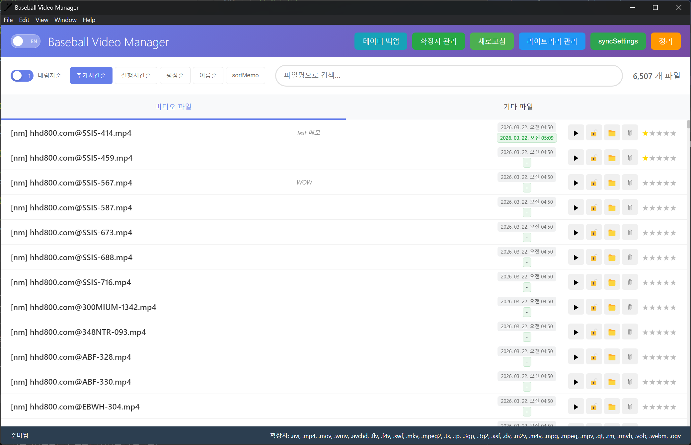

# Baseball Video Manager

**Windows 전용 고성능 비디오 파일 관리 도구**

대용량 미디어 라이브러리를 한 화면에서 검색, 정렬, 평가, 메모하고 Git 기반으로 자동 백업하는 데스크톱 애플리케이션입니다.




---

## Features

### File Management
- **6,500+ 파일 관리** — 가상 스크롤링으로 대용량 목록도 60fps 유지
- **27개 비디오 확장자** 기본 지원, 사용자 추가/삭제 가능
- **듀얼 탭** — 비디오 파일 / 기타 파일(압축 등) 분리 관리
- **다중 라이브러리** — 여러 드라이브의 폴더를 하나로 통합

### Metadata & Rating
- **5단계 별점** — 클릭으로 즉시 평가, NTFS ADS에 저장
- **인라인 메모** — 메모 컬럼 클릭 → 바로 편집 (Enter 저장, Esc 취소)
- **재생 이력** — 마지막 실행 시각, 재생 횟수 자동 기록
- **추가 시각** — 라이브러리에 등록된 시점 추적

### Search & Sort
- **실시간 검색** — 타이핑 즉시 필터링 + 검색어 하이라이트
- **6가지 정렬** — 추가시간 / 실행시간 / 평점 / 이름 / 메모 + 오름차순/내림차순 토글
- **정렬 유지** — 검색, 탭 전환, 파일 추가/삭제 후에도 현재 정렬 상태 유지

### Git Sync (Cloud Backup)
- **원격 백업** — GitHub 등 Git 저장소에 메타데이터 자동/수동 업로드
- **복원** — 새 PC에 설치 후 Git에서 데이터 다운로드
- **자동 동기화** — 체크박스 활성화 시 변경사항 30초 디바운스 후 자동 push
- **빈 데이터 보호** — 빈 상태로 원격을 덮어쓰지 않음

### Performance
- **Windows Search API** — 시스템 인덱스 활용으로 10,000개 파일 500ms 이내 스캔
- **하이브리드 파일 감시** — chokidar 실시간 감시 + Windows Search 병렬 처리
- **NTFS ADS 메타데이터** — 별점/메모를 파일 자체에 저장 (이동해도 유지)
- **GPU 깜빡임 방지** — 하드웨어 가속 비활성화로 스크롤 시 전체 화면 깜빡임 해결

---

## Installation

### Setup (권장)
[Releases](../../releases)에서 `Baseball Video Manager Setup x.x.x.exe`를 다운로드하여 설치합니다.

- 기본 설치 경로: `%LOCALAPPDATA%\Baseball Video Manager\`
- 데이터 저장 경로: `%APPDATA%\Baseball Video Manager\data\`
- **업데이트 시 데이터 유지** — Setup 재실행해도 메타데이터, 설정 보존

### Portable
`Baseball Video Manager x.x.x.exe` 단일 파일 실행. 설치 불필요.

### Build from Source

```bash
# 의존성 설치
npm install

# 개발 모드
npm run dev

# Windows Setup 빌드
npm run build:win-setup

# Windows Portable 빌드
npm run build:win-portable

# 둘 다 빌드
npm run build:win
```

---

## Usage

### 시작하기

1. 앱 실행 → **라이브러리 관리** → 비디오가 있는 폴더 추가
2. 자동으로 파일 스캔 및 목록 표시
3. 파일 클릭으로 재생, 별점/메모로 관리

### 파일 목록 컬럼

| 컬럼 | 설명 |
|------|------|
| 파일명 | 더블클릭으로 재생 |
| 메모 | 클릭하여 인라인 편집 |
| 추가시각 / 실행시각 | 등록일, 마지막 재생일 |
| ▶ 🔓 📁 🗑 | 재생 / Lada 전송 / 폴더 열기 / 삭제 |
| ★★★★★ | 클릭으로 별점 토글 (같은 별 클릭 시 해제) |

### Git 동기화

1. **동기화** 버튼 → 저장소 URL + Personal Access Token 입력 → **저장**
2. **현재 데이터 업로드** — 로컬 데이터를 Git에 push
3. **Git에서 데이터 가져오기** — 원격 데이터로 로컬 덮어쓰기 (새 설치 시)
4. **자동 동기화** 체크 — 변경 시 자동 업로드 (기본 해제, 설정 저장됨)

### 키보드 단축키

| 단축키 | 기능 |
|--------|------|
| `Ctrl + F` | 검색 포커스 |
| `Ctrl + R` / `F5` | 새로고침 |
| `Ctrl + 1` | 비디오 탭 |
| `Ctrl + 2` | 기타 파일 탭 |
| `Ctrl + L` | 라이브러리 관리 |
| `ESC` | 검색 초기화 / 모달 닫기 |

---

## Architecture

```
src/
├── main/                          # Electron 메인 프로세스
│   ├── electron.js                # IPC 핸들러, 윈도우 관리
│   ├── data-sync.js               # Git 동기화 모듈
│   ├── hybrid-file-watcher.js     # 파일 감시 (chokidar + Windows Search)
│   ├── windows-metadata-manager.js # NTFS ADS 메타데이터 R/W
│   └── windows-search-scanner.js  # Windows Search API 쿼리
└── renderer/                      # UI (Vanilla JS)
    ├── index.html
    ├── styles/main.css
    └── js/
        ├── main.js                # App 클래스, 이벤트, 정렬
        ├── file-manager.js        # 파일 CRUD, 검색, 하이브리드 시스템
        ├── virtual-scroll.js      # 가상 스크롤 + 인라인 메모 편집
        ├── search-engine.js       # 검색 디바운싱, 하이라이트
        ├── library-manager.js     # 라이브러리 경로 관리 모달
        ├── extension-manager.js   # 확장자 관리 모달
        ├── i18n.js                # 한국어/영어 전환
        └── utils.js               # 포맷팅, 별점 생성
```

### Data Storage

| 파일 | 위치 | 내용 |
|------|------|------|
| `lib.json` | data/ | 라이브러리 폴더 경로 목록 |
| `media/files.json` | data/ | 비디오 파일 메타데이터 (별점, 메모, 재생이력) |
| `file/files.json` | data/ | 기타 파일 메타데이터 |
| `extensions.json` | data/ | 사용자 지정 확장자 설정 |
| `sync-settings.json` | data/ | Git 동기화 설정 (gitignore) |

---

## Supported Formats

### Video (기본 27종, 추가 가능)
`.avi` `.mp4` `.mov` `.wmv` `.avchd` `.flv` `.f4v` `.swf` `.mkv` `.mpeg2` `.ts` `.tp` `.3gp` `.3g2` `.asf` `.dv` `.m2v` `.m4v` `.mpg` `.mpeg` `.mpv` `.qt` `.rm` `.rmvb` `.vob` `.webm` `.ogv`

### Archive (기본 7종, 추가 가능)
`.zip` `.7z` `.ezc` `.alzip` `.001` `.zpaq` `.rar`

**확장자 관리** 버튼에서 자유롭게 추가/삭제할 수 있습니다.

---

## Tech Stack

| 구성 | 기술 |
|------|------|
| Framework | Electron 28 |
| Language | Vanilla JavaScript (프레임워크 없음) |
| UI | HTML5 + CSS3 + SUIT 폰트 |
| File Watch | chokidar + Windows Search API |
| Metadata | NTFS Alternative Data Streams |
| Backup | archiver (ZIP), Git push |
| Build | electron-builder (NSIS + Portable) |

---

## License

MIT
